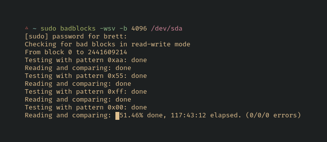

# Homelab

Don't be fooled, having a home server is really just hundreds of hours of [badblocks](https://wiki.archlinux.org/index.php/Badblocks).



## Setup

Run setup to create local configuration files.

```sh
make setup
```

Then, edit `inventory` with the server target and `vars/secret.yml` with secrets.

## Playbooks

See [Working with playbooks](https://docs.ansible.com/ansible/latest/user_guide/playbooks.html) and [ansible-playbook](https://docs.ansible.com/ansible/latest/cli/ansible-playbook.html)

### Bastion provision

Provision and setup a bastion server with a Digital Ocean Droplet. The setup creates a WireGuard server on the remote host and creates a client configuration on the home server. DNAT and SNAT traffic to and from the home server is routed through the bastion node with iptables.

### Upgrade

Upgrade pacman and apt cache, packages and the apt distribution.

### Server setup

Deploy docker compose and run the rootless container orchestration.

Setup [SnapRAID](https://www.snapraid.it/) for JBOD disk parity and configure cron to run a [snapraid-runner](https://github.com/Chronial/snapraid-runner) script to sync parity and periodically check the data for errors.


## Docker orchestration

### Traefik Reverse Proxy

-   [x] Use [Traefik OAuth](https://github.com/thomseddon/traefik-forward-auth)
-   [ ] Switch to [KeyCloak](https://www.keycloak.org/index.html) or [Authelia](https://github.com/clems4ever/authelia)
-   [ ] Update to Traefik v2

### Debug

[HTTP request output](https://github.com/traefik/whoami)

```sh
docker run --rm -it -p 10.0.0.2:80:80 --name iamfoo containous/whoami
```

Print the IP, network and listening ports for each container

```sh
docker inspect -f '{{.Name}}-{{range  $k, $v := .NetworkSettings.Networks}}{{$k}}-{{.IPAddress}} {{end}}-{{range $k, $v := .NetworkSettings.Ports}}{{ if not $v }}{{$k}} {{end}}{{end}} -{{range $k, $v := .NetworkSettings.Ports}}{{ if $v }}{{$k}} => {{range . }}{{ .HostIp}}:{{.HostPort}}{{end}}{{end}} {{end}}' $(docker ps -aq) | column -t -s-
```
