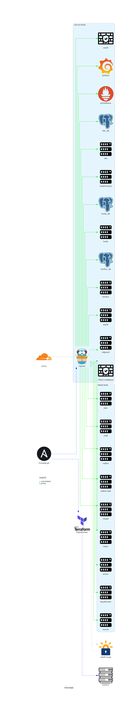

# Homelab diagrams



## Develop

[Diagrams](https://github.com/mingrammer/diagrams) allows prototyping architecture diagrams as code.

Use a virtual python environment like [virtualenvwrapper](https://wiki.archlinux.org/title/Python/Virtual_environment#virtualenvwrapper). This project uses [`poetry`](https://python-poetry.org/) rather than `pip`. If you're using vscode, you may consider the [python ext setup](https://code.visualstudio.com/docs/languages/python#_environments).

```sh
make setup
```

Build the diagrams.

```sh
make build
```
