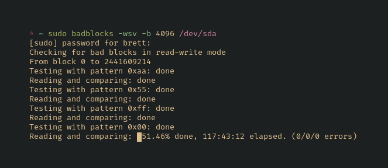

# Storage

## Hardware

### Check disks

Use [badblocks](https://wiki.archlinux.org/index.php/Badblocks) to check the status of new disks.



This command will take a long time for larger drives, but it's worth it to be thorough before determining whether to make a return.

This is a destructive test, so it's probably best to use `/dev/disk/by-id` to be certain you're targeting the correct drive.

Use `tune2fs -l <partition>` as the root user to identify the block size.

```sh
sudo badblocks -wsv -b 4096 /dev/sda > sda_badblocks.txt
```

Here's some additional advice from [/r/DataHoarders](https://www.reddit.com/r/DataHoarder/comments/7seion/new_drive_first_steps_you_take_before_using/).

### Cheap PCIe SATA

I purchased a [Dell Perc H310](https://www.ebay.com/sch/i.html?_nkw=Dell+Perc+H310+SATA) a long while back. Mine did come from China, but it turned out to be legit. [This video](https://www.youtube.com/watch?v=EOcpp-GdhKo) shows how it can be flashed to an LSI 9211-8i IT (see also [1](https://www.servethehome.com/ibm-serveraid-m1015-part-4/), [2](https://www.truenas.com/community/threads/confused-about-that-lsi-card-join-the-crowd.11901/)).

## [mergerfs](https://github.com/trapexit/mergerfs)

This is a union filesystem for pooling drives together. It's a great pair with SnapRAID.

```sh
mkdir /mnt/disk{1,2,3,4}
mkdir /mnt/parity1 # adjust this command based on your parity setup
mkdir /mnt/storage # this will be the main mergerfs mount point (a collection of your drives)
```

Mount drives to these folders, then add `/etc/fstab` entries by ID.

```sh
ls /dev/disk/by-id
```

You must also include an entry for the MergerFS union, such as:

```
/mnt/disk* /mnt/storage fuse.mergerfs allow_other,use_ino,cache.files=partial,dropcacheonclose=true,category.create=mfs,fsname=mergerfs,minfreespace=10G 0 0
```

See also [perfectmediaserver: MergerFS](https://perfectmediaserver.com/installation/manual-install/#mergerfs)
